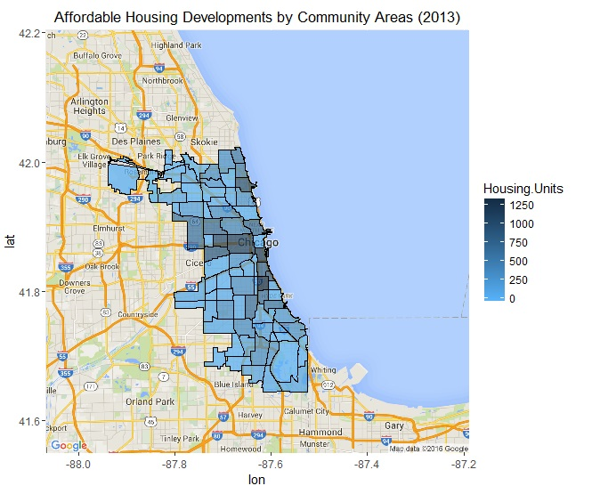
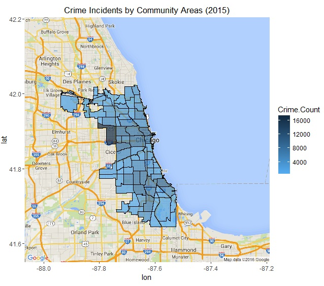
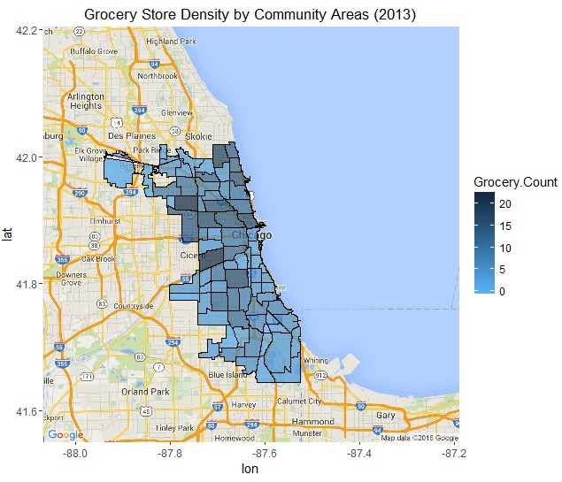
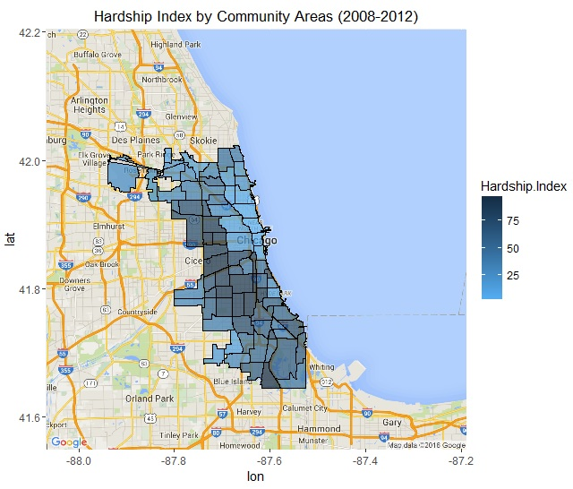
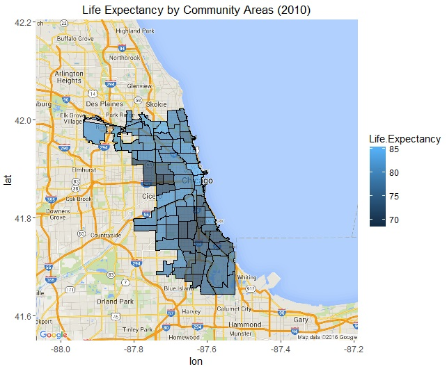
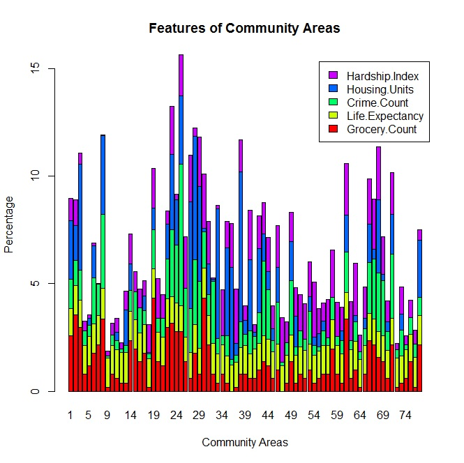
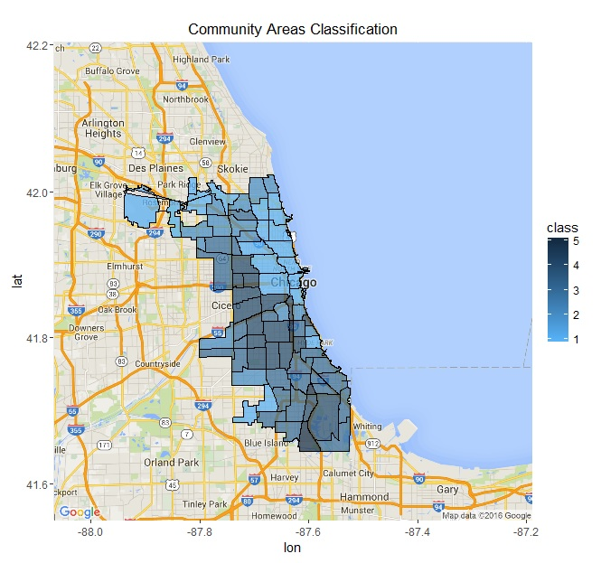

### Instructions

1. The file Affordable_Rental_Housing_Developments.csv contains the data for housing development units.
2. The file Crimes_2015.csv contains the crime incidents records for the year 2015 on the city of Chicago data portal.
3. The file GroceryStores_2013.csv contains the data for grocery stores in Chicago community areas.
4. The file Life_Expectancy_2000.csv contains the data for the life expectancy for the year 2010 as well.
5. The file SocioEconomicData_2008_2012.csv contains the hardship index data.
6. The community areas directory have the shape files required for the map of community areas along with the csv file.
7. Before executing the script make sure all the scripts are copied into the dat directory so that all the scripts and data are in one place.
8. The result images will be displayed when the script is run. Sample are provided in the imgs directory.

#### Affordable Housing Units by Community Area

#### Crime Incidents by Community Area

#### Grocery Stores by Community Area

#### Hardship Index by Community Area

#### Life Expectancy by Community Area

#### Features of Community Areas

#### Classification of Community Areas

### DataSource

CityofChicago Data Portal
