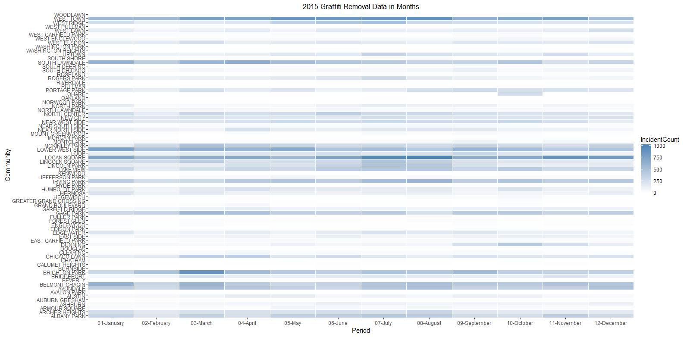
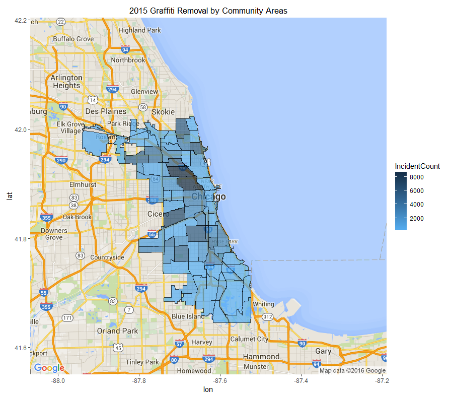

### Instructions

1. The file dat/Graffiti_Removal_2015.csv is the main data file with 2015 Graffiti removal data of Chicago by community areas.
2. The community areas directory have the shape files required for the map of community areas along with the csv file.
3. The result images will be displayed when the script is run. Sample are provided in the img directory.
#### Graffiti Removel By Months 2015 HeatMap

#### Graffiti Removal By Area 2015

### DataSource

CityofChicago Data Portal
